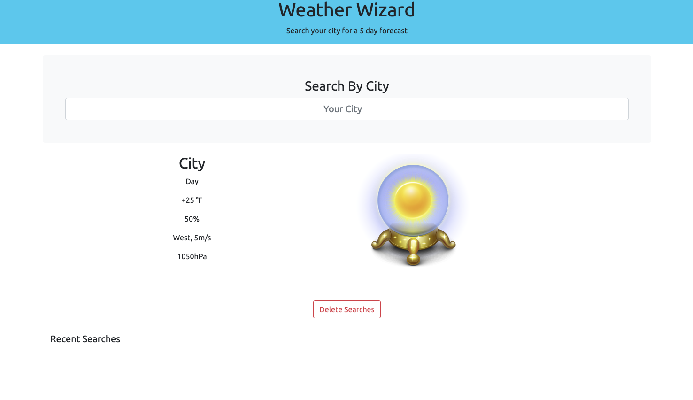

# Weather-Wizard

This is a simple weather app that displays the current weather in a searched city, as well as a presents 5 day forecast.

# Scope of Work

This is built primarily with JavaScript, bootstrap, and some light CSS styling. I still need to have previous saved searches stored in local history as well as use my own images for weather conditions. 

## Website URL

My website can be accessed [here](https://crystal-coding-time.github.io/weather-wizard/)

## Authors

* Eli D. Ter Keurst

## Preview 

A preview of the site can be found below:

## Credits

N/A

## License

N/A